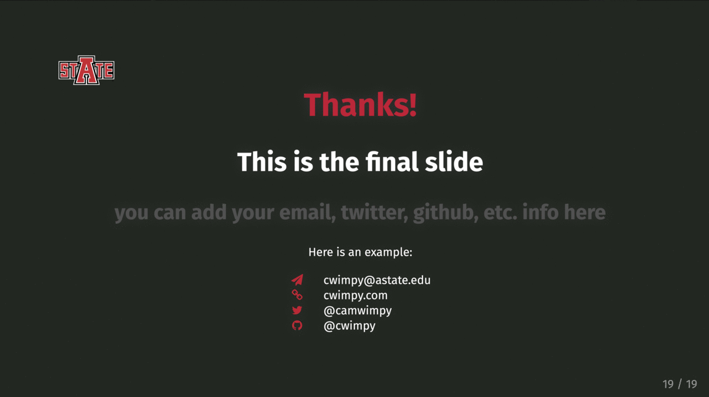

# astate_xaringan

Minimalist xaringan theme for html presentations using A-State style/colors. I based this off of the Rutgers theme with modifications for the A-State style. 

## Examples



## Usage

Place the `astate.css` and `astate-fonts.css` files in your `xaringan` distribution and use the YAML header below to create a presentation. 

```
title: "Title here"
subtitle: "Sub-title here"
author: "Your Name"
date: "Arkansas State University </br> `r Sys.Date()`"
output:
  xaringan::moon_reader:
    lib_dir: libs
    css: ["astate", "astate-fonts"]
    nature:
      beforeInit: "../js/astate_xaringan.js"
      highlightStyle: github
      highlightLines: true
      countIncrementalSlides: false
      ratio: "16:9"
```